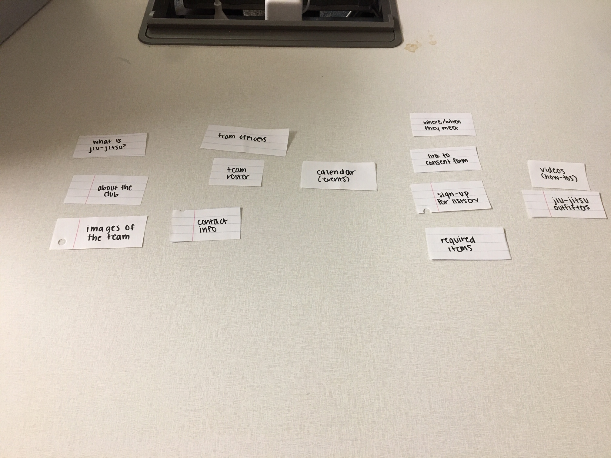

# Project 4 - Design & Plan

Be clear and concise in your writing. Bullets points are acceptable.


# Planning

## Client Description (Milestone 1) - Ava
> Tell us about your client. Who is your client? What kind of website do they want? What are their key goals?

Our client is the Cornell Brazilian Jiu Jitsu club. They would like a website for outreach to new members and to educate newcomers about what jiu jitsu is. Their key goals are to inform potential new members about the club and to make jiu jitsu more accessible to beginners.

> NOTE: **If you are redesigning an existing website, give us the current URL and some screenshots of the current site.** Tell us how you plan to update the site in a significant way that meets the Project 4 requirements.


## Site's Purpose (Milestone 1)
> Tell us the purpose of the website and what it is all about.

The website's purpose is to educate potential new members about what jiu jitsu is and what the club is. Through the website, the club wants to make jiu jitsu more accessible to a larger audience, especially at Cornell.

## Client Meeting Notes (Milestone 1)
> Include your notes/minutes from the client meeting, an email they sent you, or whatever you used to keep track of what was discussed at the meeting.


## Client Needs and Wants (Milestone 1)
> Collect your client's needs and wants for the website. Come up with several appropriate design ideas on how those needs may be met. In the **Memo** field, justify your ideas and add any additional comments you have. There is no specific number of needs required for this, but you need enough to do the job.

Needs/Wants:
- **Needs and Wants** [What does your client need and want?]
- Inform beginners about what jiu jitsu is
- **Design Ideas and Choices** [How will you meet those needs and wants?]
- Have a "Jiu Jitsu Basics" page that includes a summary of the sport and reference videos/what gear jiu jitsu entails
- **Memo** [Justify your decisions; additional notes.]
- Having a dedicated page will give newcomers a clear page to visit if they want to learn more about how to get started with the sport

- **Needs and Wants**
- Calendar to show schedule
- **Design Ideas and Choices**
- Include an interactive calendar that shows the schedule for practices/events
- **Memo**
- Standalone calendar would make the events/schedule for the club clear and organized, members would be informed about events

- **Needs and Wants**
- Information about the club, what they are, where they meet, and when
- **Design Ideas and Choices**
- On the home page, include images and a summary of what the club is and when/where they meet
- **Memo**
- Having the most essential information about the club on the home page will make the club more accessible to potential members

- **Needs and Wants**
- A way for potential members to show interest in the club/sign up for more information
- **Design Ideas and Choices**
- Include a form to sign up for listserv/show interest in the club
- **Memo**
- Form can also include skill level

## User(s) (Milestone 1) - Asher
The primary purpose of this website is member recruitment and conversion. That makes the intended audience for this site Cornell students who are not currently in the club, but who have an interest either in jiu-jitsu, more generally martial arts, or simply in finding a new way to stay fit while on campus.

## Discovering Users' Needs (Milestone 1) -Asher
> You'll need to discover your users' needs. Talk to them! Document what you've learned about them. When talking to your users, take notes and include those notes here.


## Users' Needs (Milestone 1) -Asher
> Analyze the users' needs and wants from your notes above. List each need/want below. There is no specific number of needs required for this, but you need enough to do the job.
> **Note:** These are probably *not* the needs of your client.

Need/Want: Where/when
- **Needs and Wants** [What do the users need and want?]
- Needs to know when the club meets and where
- **Design Ideas and Choices** [How will you meet those needs and wants?]
- Will have the location and time of club meetings on the home page
- **Rationale & Additional Notes** [Justify your decisions; additional notes.]
- This was a common need, so it makes sense to have the information easily accessible as one of the first things the user sees on the site

Need/Want: jiu-jitsu info
- **Needs and Wants**
- Information about jiu-jitsu is relatively limited, so they need info about what it is
- **Design Ideas and Choices**
- Have a dedicated jiu-jitsu page that includes a summary of what it is and tips about how to get started and improve
- **Rationale**
- makes sense to have its own page so it doesn't crowd out other content
- makes the information easily accessible from the nav

Need/Want: Able to use on phones
- **Needs/wants**
- users said they would probably access the website on the phone more than their Desktop
- needs mobile design to be easy to use
- **Design Ideas and Choices**
- hamburger navigation so the site's easy to navigate on Mobile
- all content will scale down to mobile and font size will increase
- calendar will work on mobile as well
- **rationale**
- It's easier to check things like times and events on the go using a phone, so this trend makes sense.


## User Testing Plan (Milestone 1) - Jonna
> Plan out your tasks for evaluating whether your site will meet the needs of the users. These must be actual user testing tasks. Tasks are not questions!

You just got to Cornell for your first week of college! Having done jiu jitsu for several years, you really want to get involve in the Cornell jiu jitsu club and happened to stumble across their website.

1. Exploring the site, where and when does jiu jitsu club meet? (You'll be sure to show up!)

2. You want to see a few people on the team before you actually go to practice. Find who the two officers of the club are.

3. After browsing a bit, you're definitely interested in joining! Sign up for the listserv and find the consent form you need to sign before going to the first meeting.

4. You realize you forgot to bring your jiu jitsu uniform to Ithaca - move-in was too hectic! Find where you can get another jiu jitsu uniform as well as any other equipment you need to join the club.

## Content (Milestone 1) - Jonna
> Plan out your site's content (text, images, etc.). Make a list of **all** the content you will need. This list should be **exhaustive**.

- images
- club group photo
- jiu jitsu practice in action
- jiu jitsu uniform
- photos/headshots of the officers
- required items/equipment to get started
- text
- description of the club
- where/when the club meets
- what is jiu jitsu?
- contact information of officers
- contact information of the club
- required items/equipment to get started
- where to get jiu jitsu uniforms
- team roster (names of members)
- videos
- how to videos
- stretches to do at home
- introductory moves
- forms
- sign up for listserv
- consent form (PDF)
- calendar of jiu jitsu practices/events


of the team
- description of the club
- where/when the club meets

## Interactivity Ideas (Milestone 1) - Leo
> Come up with some idea for interactive features for your site.


- the form will be able to be filled out by the user
- image gallery will be able to be scrolled through by the user
- being able to navigate through the calendar.


# Design & Evaluation

## Design Process (Milestone 1)
> Document your design process. Show us your card sorting. Design your navigation from the card sorting. Outline your navigation. Describe your theme. Show us sketches of your site (mobile and desktop versions). etc.
> You should show us how your came up with your design and how your iterated on that design; show us the evolution of your design.

> **Note:** Card sorting is used to organize your site's content. For each piece of content identified in the previous section, write a summary of that content onto a card. Now sort the cards. The grouping of cards provides you with your pages for your website. **Do not write down the pages you want and then "card sort" those. That is not card sorting.**

* Card sorting
* Card Sort A:
* Like how sign up is on first page grouped with about the club
* What is jiu jitsu page, not sure about the videos + consent form grouping

* Card Sort B:
* Fourth group: everything you need to join the club
* Link between videos + outfitters?

* Card Sort C:
* Calendar should be own page, what is the link between where/when + sign up for listserv
* images of team should be more central
* like about the club and what is jiu jitsu

* Card Sort D:
* like the what is jiu jitsu grouping
* contact info should go with team officers
* like sign up and link together

* Final Card Sort:


## Initial Design Sketches
- Home draft sketch - Jonna


- Jiu-Jitsu Basics
- Videos (Asher)

- Full Page


- Calendar sketches- Asher


- Calendar page sketch -Asher


- Meet the Team Sketch - Leo

- Signup draft sketch - Ava


## Interactivity (Milestone 1) - Leo
Calendar, sign up form, and image gallery. All this meets the needs of our client because the calendar will show what days the jiu-jitsu club will meet, the image gallery will provide them a visual of what the club is like, and the consent form will let them fill out the agreement to join the club. The image gallery can be clicked on and you can transition from one picture to another. The calendar will work by displaying a digital calendar and you can click on the days to see what events are going and their respective times.

...


## Final Design (Milestone 1)
> Include the final sketches for each of your pages. These sketches **must** hand-drawn.

**Desktop Design:**
- Homepage Final Sketch (Desktop) - Jonna


- Jiu-Jitsu Basics page
- Videos (Asher)

- Full page

- Meet the Team Final Sketch (Desktop) - Leo


- Signup Final Sketch (Desktop) - Ava


- Calendar Final Sketches(Desktop)-Asher


**Mobile Design:**

- Homepage Final Sketch (Mobile) - Jonna


- Jiu-Jitsu basics page
Videos (mobile)


Full page (mobile)

- Meet the Team Final Sketch (Mobile) - Leo


- Signup Final Sketch (Mobile) - Ava


- Calendar Final Sketch (Mobile) -Asher


## Additional Comments (Milestone 1)
> If you feel like you haven't fully explained your design choices, or if you want to explain some other functions in your site (such as special design decisions that might not meet the Project 4 requirements), you can use this space to justify your design choices or ask other questions about the project and process.


---

# Iteration 2

## Client Feedback (Milestone 2)
> You have met once with your client a second time to discuss your initial design. Include your notes from the meeting, an email they sent you, or whatever you used to keep track of what was discussed at the meeting. Write a few sentences about the design feedback you received from your client.

- Fundamentals Class Schedule
- Monday 8-9PM
- Friday 6:30-7:30PM
- Regular Class Schedule
- Monday 8-9PM
- Wednesday 7:30-8:30PM
- Friday 6:30-7:30PM

- Uniform is not required (just optional/suggested)
- Change to "What to Wear" instead of "Required Items"
- Stress that "MMA-related"
- Videos Ideas:
- Five minute round
- How to tie your belt
- How to roll
- Want cool, high quality videos
- Questions/Contact Form for interactivity
- FAQ content/page?

- Meet the Team Page
- Team officer bios?
- Info about Tony Greenberg (his lineage, etc.)

## Interactivity Plan (Milestone 2)
> Write your interactivity pseudocode here.

Image Gallery Pseudocode (Jonna):
```
1. store an array of images
2. if next button is clicked, set carousel image source to the next image in the array
3. if prev button is clicked, set carousel image source to the previous image in the array
```
Calendar pseudocode (Asher):

How the data is stored:
```
1. create two lists, one of days of the week and one of months.
    2. For the days of the week
        a. link each day of the week to the regularly scheduled events for that day (one list of days and one of times)
    3. For the months of the year
        a. give each month a number of days and a list of "special" events not regularly scheduled for a given day
```

How the data is displayed:
```
1. Use javascript to get the current month and the year
2. Find that month in the list
3. Use js to find the first day of that month
4. Starting from that day, add the date to each box on the calendar
5. Add the name of the month and the year to the title of the calendar header

When a day is clicked:
1. Find the relevant day's time and events
2. Add to the pop up's time field the list of Times
3. add to the event field the list of events
4. set the pop up display to fixed.
5. Set the pop up title to the date

When the close button is clicked:
1. set the pop_up display to none

When the 'next' button is pressed
1. if the current month isn't December
    set the current month to be one later than the current month
2. else
    add one to the current year
    set the current month to January

When the 'previous' button is pressed
1. if the current month isn't January
    set the current month to be one less than the current month
2. else
    subtract one from the current year
    set the current month to December
```

Sign Up Form Pseudocode (Ava):
```
When the user tries to submit the form:  
If the name HTML5 validation criteria has not been met:  
Show the feedback message, "Must enter a valid name."  
Do not submit the form.  
If the email HTML5 validation criteria has not been met:  
Show the feedback message, "Must enter a valid email address."  
Do not submit the form.   
If the interest textbox HTML5 validation criteria has not been met:
Show the feedback message, "Please input a response that is between 10 to 500 characters in length."
Otherwise,  
Show no feedback message.  
Submit the form to the server.
```

## Additional Comments (Milestone 2)
> If you feel like you haven't fully explained your design choices, or if you want to explain some other functions in your site (such as special design decisions that might not meet the Project 4 requirements), you can use this space to justify your design choices or ask other questions about the project and process.


---

# Iteration 3

## Additional Comments (Milestone 3)
> If you feel like you haven't fully explained your design choices, or if you want to explain some other functions in your site (such as special design decisions that might not meet the Project 4 requirements), you can use this space to justify your design choices or ask other questions about the project and process.


---

# Final Evaluation

## Changes Based on Lab 13 Peer Feedback (Final Submission)
> What changes did you make to your design based on your peers' feedback?

(Jonna) I altered the slideshow so that it had buttons instead of automatically playing. This was to avoid the slideshow being too abrupt and distracting from the rest of the page.

(Asher) I blocked out inactive days on the calendar, added a hover effect so that users know they can click on the days, and set the nav element for the current page to red

## User Testing
> If you conducted user testing in Milestone 1, you only need to user test 2 more users. Otherwise, you must conduct user testing with 4 users.

### User 3 - Testing Notes (Final Submission)


### User 3 (Final Submission)

1. Who is your user, e.g., where does the user come from, what is the user's job, characteristics, etc.?


My user is a Cornell Freshman who is studying physics in the college of arts and sciences, although her major isn't 100% decided. She loves to find new books to read and go online shopping in her free time.

2. Does the user belong to your target audience of the site? (Yes / No)

Yes, because although she has never done jiu jitsu before, she is interested in joining new clubs and learning new skills.

### User 3 - **Desktop** (Final Submission) (Jonna)

Task: Exploring the site, where and when does jiu jitsu club meet? (You'll be sure to show up!)
- **Did you evaluate the desktop or mobile design?**
- Desktop
- **How did the user do? Did they meet your expectation?**
- The user did as I expected - they were able to locate the correct information on the homepage without too much exploration around the rest of the website.
- **User’s reaction / feedback to the design** (e.g., specific problems or issues found in the tasks)
- Due to the size of the slideshow, they had to scroll to find the information as it was hidden/pushed down at first. However, they didn't feel like it was too much of a problem as they really enjoyed how the slideshow looked visually.
- **Your reflections about the user’s performance to the task**
- The user performed as I expected without too many obstacles. I was pleased that they were able to use the website correctly.
- **Re-design choices**
- For re-design, I don't really think there was much to do because the user commented that I shouldn't change the size of the slideshow and the information was easy enough to find.

Task: You want to see a few people on the team before you actually go to practice. Find who the two officers of the club are.
- **Did you evaluate the desktop or mobile design?**
- Desktop
- **How did the user do? Did they meet your expectation?**
- The user was able to successfully complete this task and meet my expectation.
- **User’s reaction / feedback to the design** (e.g., specific problems or issues found in the tasks)
- The user scanned over the nav bar and then clicked for the 'Meet the Team' page. They scrolled up and down the page and finally found the names of the two officers.
- **Your reflections about the user’s performance to the task**
- I was pleased by how simply and smoothly the user was able to perform the task.
- **Re-design choices**
- Per the user's performance, no re-design opportunities really came up. The user was already able to find the needed information quite effectively.

Task: After browsing a bit, you're definitely interested in joining! Sign up for the listserv and find the consent form you need to sign before going to the first meeting.
- **Did you evaluate the desktop or mobile design?**
- Desktop
- **How did the user do? Did they meet your expectation?**
- The user was able to complete a part of the task but not all of it.
- **User’s reaction / feedback to the design** (e.g., specific problems or issues found in the tasks)
- The user was able to locate the sign up and forms correctly; however, after clicking on the external link on the bottom of the page for the waiver form, she could not find the actual form itself.
- **Your reflections about the user’s performance to the task**
- We need to locate the link for the actual pdf of the waiver form so that it's easier for the audience to find!
- **Re-design choices**
- Change the link to the waiver form so that it's more accessible.

Task: You realize you forgot to bring your jiu jitsu uniform to Ithaca - move-in was too hectic! Find where you can get another jiu jitsu uniform as well as any other equipment you need to join the club.
- **Did you evaluate the desktop or mobile design?**
- Desktop
- **How did the user do? Did they meet your expectation?**
- The user was able to locate the four online stores/platforms that they can purchase from! This met my expectation.
- **User’s reaction / feedback to the design** (e.g., specific problems or issues found in the tasks)
- The user went to the jiu-jitsu basics page via the navigation bar. They then scrolled down and started reading the what to wear section. Then they finally read the "wear to get gear" section and found the correct answer to the task. They told me afterwards that the information was pretty easy to find.
- **Your reflections about the user’s performance to the task**
- The user's performance was quite smooth in doing the task. This is probably thanks to our straight forward layout and clear header/titles.
- **Re-design choices**
- The user was able to adequately finish the task with the design that we have now, so I have decided to retain it as it is.

...


### User 4 - Testing Notes (Final Submission)

> When conducting user testing, you should take notes during the test. Place your notes here.


### User 4 (Final Submission)
> Using your notes from above, describe your user by answering the questions below.

1. Who is your user, e.g., where does the user come from, what is the user's job, characteristics, etc.?

Aidan is a freshman living on north campus. He's thinking of double majoring in classics and physics, but has a huge interest in latin literature (which he is fluent in).

2. Does the user belong to your target audience of the site? (Yes / No)

 Yes. Aidan has some experience in martial arts, but dropped it a long time ago. However, he has some interest learning more about the different physical fitness groups on campus.


### User 4 - **Mobile** (Final Submission)
> Report the results of your user's evaluation. You should explain **what the user did**, describe the user's **reaction/feedback** to the design, **reflect on the user's performance**, determine what **re-design choices** you will make. You can also add any additional comments. See the example design journey for an example of what this would look like.

Task: [Exploring the site, where and when does jiu jitsu club meet? (You'll be sure to show up!)]
- **Did you evaluate the desktop or mobile design?**
- Pick one: Mobile
- **How did the user do? Did they meet your expectation?**
- The user was able to find the location and time of meetings very easily. Starting on the home page, he simply scrolled down and saw the information on the bottom right half of the screen and saw the information there.
- **User’s reaction / feedback to the design** (e.g., specific problems or issues found in the tasks)
- While the user was able to find the information easily, they weren't sure off the top of their head where that location was. However, the address was in an easily readable format and they knew they'd be able to find it on google maps.
- **Your reflections about the user’s performance to the task**
- I was pleased that they were able to find the information easily. Obviously, I can't expect that every user is going to automatically know the location of all buildings off the top of their head. However, considering that most people will simply use their phones to get directions through a maps app, I'm not concerned about adding that functionality.
- **Re-design choices**
- None
- **Additional Notes**
- No added functionality needed


Task: You want to see a few people on the team before you actually go to practice. Find who the two officers of the club are.
**Did you evaluate the desktop or mobile design?**
- Mobile
**How did the user do? Did they meet your expectation?**
- the user was able to choose the right page from the navigation and go to the meet the team page. Once there, he saw the officers' names and pictures, as well as their contact info.
**User’s reaction / feedback to the design**
- The user thought the information was relatively easy to find, but was confused why the officers' contact info was separate from their name, picture, and bio. He thought that if he wanted to contact them, having all the info in one place would be helpful.
**Your reflections about the user’s performance to the task**
- I agree with the user about the placement of the contact info. Having all of the information in one place could be helpful in such a regard, and could make the site more efficient
**Re-design choices**
-
**Additional Notes**


Task: After browsing a bit, you're definitely interested in joining! Sign up for the listserv and find the consent form you need to sign before going to the first meeting.

**Did you evaluate the desktop or mobile design?**
- Mobile
**How did the user do? Did they meet your expectation?**
- Firstly, the user was able to find the correct page very easily, and used the nav to get there. Once there, I had to intervene to explain that the information would not be sent to any external source, but once he was reassurred as to the confidentiality of his responses he filled out the form easily, using the keyboard to navigate the fields. He then submitted with no errors. Once he did that he was able to click the link to be forwarded to the waver.
**User’s reaction / feedback to the design**
- User thought that the navigation and organization of information was well laid out and intuitive. Similarly, they thought the form was easy to use, and reported that they had no trouble understanding what to enter for each field
**Your reflections about the user’s performance to the task**
- I'm pleased the user was able to understand the site layout without intervention, and that they were able to know what information was necessary to complete the form
**Re-design choices**
- None
**Additional Notes**

Task: You realize you forgot to bring your jiu jitsu uniform to Ithaca - move-in was too hectic! Find where you can get another jiu jitsu uniform as well as any other equipment you need to join the club.

**Did you evaluate the desktop or mobile design?**
- Mobile
**How did the user do? Did they meet your expectation?**
- The user hesitated a moment, but then immediately went for the correct page on the nav.
**User’s reaction / feedback to the design**
**Your reflections about the user’s performance to the task**
**Re-design choices**
**Additional Notes**


### User 5 - Testing Notes (Final Submission)- (Ava)
> When conducting user testing, you should take notes during the test. Place your notes here.


### User 5 (Final Submission)
> Using your notes from above, describe your user by answering the questions below.

1. Who is your user, e.g., where does the user come from, what is the user's job, characteristics, etc.?

User 2 is a first-year student at Cornell studying Computer Science in the College of Engineering. She is from Long Island. She loves everything outdoors, including hiking, kayaking, and rock climbing. She is very interested in photography as well and takes pictures around campus for fun. She is often studying in a library on Central Campus and is very busy as an engineering student. She is interested in exploring new sports/ways to exercise on campus.

2. Does the user belong to your target audience of the site? (**Yes** / No)
> If “No”, what’s your strategy of associating the user test results to your target audience’s needs and wants? How can your re-design choices based on the user tests make a better fit for the target audience?


### User 5 - **Desktop** (Final Submission)
> Report the results of your user's evaluation. You should explain **what the user did**, describe the user's **reaction/feedback** to the design, **reflect on the user's performance**, determine what **re-design choices** you will make. You can also add any additional comments. See the example design journey for an example of what this would look like.

Task 1: Exploring the site, where and when does jiu jitsu club meet? (You'll be sure to show up!)
- **Did you evaluate the desktop or mobile design?**
- Pick one: **desktop**/mobile
- **How did the user do? Did they meet your expectation?**
- The user checked the Calendar page first and then went navigated to Home to find the information, which was unexpected.
- **User’s reaction / feedback to the design** (e.g., specific problems or issues found in the tasks)
- The user thought that the general information for the club was
- **Your reflections about the user’s performance to the task**
- TODO
- **Re-design choices**
- TODO
- **Additional Notes**
- TODO: Justify your decisions; additional notes.

Task 2: You want to see a few people on the team before you actually go to practice. Find who the two officers of the club are.
- **Did you evaluate the desktop or mobile design?**
- Pick one: desktop/mobile
- **How did the user do? Did they meet your expectation?**
- TODO
- **User’s reaction / feedback to the design** (e.g., specific problems or issues found in the tasks)
- TODO
- **Your reflections about the user’s performance to the task**
- TODO
- **Re-design choices**
- TODO
- **Additional Notes**
- TODO: Justify your decisions; additional notes.

Task 3: After browsing a bit, you're definitely interested in joining! Sign up for the listserv and find the consent form you need to sign before going to the first meeting.
- **Did you evaluate the desktop or mobile design?**
- Pick one: desktop/mobile
- **How did the user do? Did they meet your expectation?**
- TODO
- **User’s reaction / feedback to the design** (e.g., specific problems or issues found in the tasks)
- TODO
- **Your reflections about the user’s performance to the task**
- TODO
- **Re-design choices**
- TODO
- **Additional Notes**
- TODO: Justify your decisions; additional notes.

Task 4: You realize you forgot to bring your jiu jitsu uniform to Ithaca - move-in was too hectic! Find where you can get another jiu jitsu uniform as well as any other equipment you need to join the club.
- **Did you evaluate the desktop or mobile design?**
- Pick one: desktop/mobile
- **How did the user do? Did they meet your expectation?**
- TODO
- **User’s reaction / feedback to the design** (e.g., specific problems or issues found in the tasks)
- TODO
- **Your reflections about the user’s performance to the task**
- TODO
- **Re-design choices**
- TODO
- **Additional Notes**
- TODO: Justify your decisions; additional notes.


### User 6 - Testing Notes (Final Submission) - Leo
> When conducting user testing, you should take notes during the test. Place your notes here.


### User 6 (Final Submission)
> Using your notes from above, describe your user by answering the questions below.

1. Who is your user, e.g., where does the user come from, what is the user's job, characteristics, etc.?
My user is a freshman in the College of Engineering majoring in Computer Science. She is from the Bay Area and is very timid and shy at first before getting to know people, but is extremely helpful, kind, and open once you get to know her.

2. Does the user belong to your target audience of the site? (Yes / No)
> If “No”, what’s your strategy of associating the user test results to your target audience’s needs and wants? How can your re-design choices based on the user tests make a better fit for the target audience?

She does belong to my target audience of the website because she's very into fitness, staying healthy, and trying out new sports and she would definitely be interested in learning more about jiu-jitsu and how to get started.

### User 6 - **Mobile** (Final Submission) - Leo
> Report the results of your user's evaluation. You should explain **what the user did**, describe the user's **reaction/feedback** to the design, **reflect on the user's performance**, determine what **re-design choices** you will make. You can also add any additional comments. See the example design journey for an example of what this would look like.

Task 1: Exploring the site, where and when does jiu jitsu club meet? (You'll be sure to show up!)
- **Did you evaluate the desktop or mobile design?**
- Pick one: mobile
- **How did the user do? Did they meet your expectation?**
- The user scrolled through the home page first and quickly noted the information and they fully met my expectations.
- **User’s reaction / feedback to the design** (e.g., specific problems or issues found in the tasks)
- The user thought that the mobile design was pretty clean to look at and the content of the website made it clear what the information would be talking about.
- **Your reflections about the user’s performance to the task**
- The user performed very well with the task. They scrolled briefly through the home page and saw the header of "Where and When We Meet" and was able to quickly deduce that this part of the website would help her finish the task.
- **Re-design choices**
- No re-design choices in mind.
- **Additional Notes**
- The big headers under each major portion of the website make it easy to differentiate each piece of information.

Task 2: You want to see a few people on the team before you actually go to practice. Find who the two officers of the club are.
- **Did you evaluate the desktop or mobile design?**
- Pick one: mobile
- **How did the user do? Did they meet your expectation?**
- The user performed the task a little slower than I expected, but overall completed the task well.
- **User’s reaction / feedback to the design** (e.g., specific problems or issues found in the tasks)
- The user noted that although the pictures of the two people help, I don't explicitly say anywhere that they are the two officers which can be confusing. Also, she said it was "sort of difficult" to find the names at first.
- **Your reflections about the user’s performance to the task**
- I am satisfied with how the user performed, but she did stare at the screen for awhile, making me question to make some design changes.
- **Re-design choices**
- I am going to create a title of their name so that it stands out along with their contact information and also make it clear that they are officers.
- **Additional Notes**
- Make it obvious they are the officers and create titles of their name and contact information.

Task 3: After browsing a bit, you're definitely interested in joining! Sign up for the listserv and find the consent form you need to sign before going to the first meeting.
- **Did you evaluate the desktop or mobile design?**
- Pick one: mobile
- **How did the user do? Did they meet your expectation?**
- The user was able to navigate to the correct page quickly and completed the necessary tasks with ease.
- **User’s reaction / feedback to the design** (e.g., specific problems or issues found in the tasks)
- The user believed that the design was simple and straightforward to use and the descriptions were very clear.
- **Your reflections about the user’s performance to the task**
- I was very pleased with how the user performed as they were able to find the correct web page quickly and the necessary information to finish the task appropriately, giving me confidence that the design is strong.
- **Re-design choices**
- None.
- **Additional Notes**
- None.

Task 4: You realize you forgot to bring your jiu jitsu uniform to Ithaca - move-in was too hectic! Find where you can get another jiu jitsu uniform as well as any other equipment you need to join the club.
- **Did you evaluate the desktop or mobile design?**
- Pick one: mobile
- **How did the user do? Did they meet your expectation?**
- The user was unsure for a bit, but deduced that the information to complete the task should be in "Jiu-Jitsu Basics" and finished, meeting my expectations mostly.
- **User’s reaction / feedback to the design** (e.g., specific problems or issues found in the tasks)
- The user believed that the headers were very helpful in indicating what the information was going to be about and that the design is very neat and easy to read.
- **Your reflections about the user’s performance to the task**
- I am happy about how the user performed because she was able to find where exactly to get another jiu-jitsu uniform and the necessary equipment through the bolded headers.
- **Re-design choices**
- None.
- **Additional Notes**
- None.


## Changes Based on User Testing (Final Submission)
> What changes did you make to your design based on user testing?


## Final Notes to the Graders (Final Submission)
> 1. Give us three specific strengths of your site that sets it apart from the previous website of the client (if applicable) and/or from other websites. Think of this as your chance to argue for the things you did really well. -Ava


> 2. Tell us about things that don't work, what you wanted to implement, or what you would do if you keep working with the client in the future. Give justifications. -Asher


> 3. Tell us what you, as a team, learned while working on this project. -Leo

We learned that working with a team instead of yourself for a website design project, that it has its benefits and cons as well. Together as a team, working together has proved to shown that we can create a website of greater quality and divide work evenly. However, there were conflicts such as meeting times as everybody has their own schedules. However, the ultimate thing that we learned while working together is that when we can effectively communicate and meet up, we can accomplish so much more and that is truly worth it in the end.

> 4. Tell us anything else you need us to know for when we're looking at the project. -Joana
